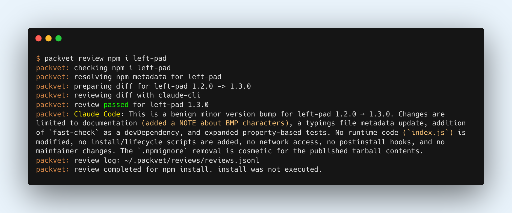

# 📦🩺 packvet

packvet = package + vet: a pre-install guard for package managers.

The [Axios npm compromise](https://www.microsoft.com/en-us/security/blog/2026/04/01/mitigating-the-axios-npm-supply-chain-compromise/)
showed the uncomfortable gap between publish and reputation: a trusted package
can ship a malicious release, and the install command may be the first code
path that runs it. CVEs, advisories, and threat-intel feeds are useful after a
package is identified, but packvet is built for the earlier moment.

Run install commands through packvet, such as `packvet npm install left-pad`,
or use `packvet review ...` when you only want the verdict. packvet pauses
fresh package releases before install, diffs them against the previous
published version, asks your configured Claude or Codex agent to review the
change, and then allows, asks, or blocks before the real package manager runs.



## Supported today

Languages and package ecosystems:

<table>
  <thead>
    <tr>
      <th>Language</th>
      <th>Package ecosystem</th>
    </tr>
  </thead>
  <tbody>
    <tr>
      <td>JavaScript / TypeScript</td>
      <td>npm</td>
    </tr>
    <tr>
      <td>Python</td>
      <td>PyPI</td>
    </tr>
    <tr>
      <td>Rust</td>
      <td>crates.io</td>
    </tr>
    <tr>
      <td>Ruby</td>
      <td>RubyGems</td>
    </tr>
  </tbody>
</table>

Package managers:

<table>
  <thead>
    <tr>
      <th>Manager</th>
      <th>Reviewed command</th>
    </tr>
  </thead>
  <tbody>
    <tr>
      <td>Bun</td>
      <td><code>bun add</code>, <code>bun install</code>, <code>bun i</code></td>
    </tr>
    <tr>
      <td>npm</td>
      <td><code>npm install</code>, <code>npm i</code></td>
    </tr>
    <tr>
      <td>pnpm</td>
      <td><code>pnpm add</code>, <code>pnpm install</code>, <code>pnpm i</code></td>
    </tr>
    <tr>
      <td>Yarn</td>
      <td><code>yarn add</code>, <code>yarn install</code></td>
    </tr>
    <tr>
      <td>pip</td>
      <td><code>pip install</code></td>
    </tr>
    <tr>
      <td>uv</td>
      <td><code>uv add</code>, <code>uv pip install</code></td>
    </tr>
    <tr>
      <td>Cargo</td>
      <td><code>cargo add</code></td>
    </tr>
    <tr>
      <td>gem</td>
      <td><code>gem install</code></td>
    </tr>
  </tbody>
</table>

Review providers:

<table>
  <thead>
    <tr>
      <th>Provider</th>
      <th>Command</th>
    </tr>
  </thead>
  <tbody>
    <tr>
      <td>Claude Code CLI</td>
      <td><code>claude</code></td>
    </tr>
    <tr>
      <td>Codex CLI</td>
      <td><code>codex</code></td>
    </tr>
  </tbody>
</table>

Direct API-key review providers are not wired yet.

## Install

### macOS / Linux

```bash
curl --proto '=https' --tlsv1.2 -LsSf https://github.com/graykode/packvet/releases/latest/download/packvet-installer.sh | sh
```

### Cargo

```bash
cargo install packvet
```

Pre-built binaries are published on the
[GitHub Releases](https://github.com/graykode/packvet/releases) page.

## Usage

Run packvet explicitly:

```bash
packvet npm install left-pad
packvet bun add left-pad
packvet pip install requests
packvet uv pip install -r requirements.txt
packvet uv add requests
packvet cargo add serde
```

For JavaScript managers, bare install commands such as `packvet npm i`,
`packvet bun install`, `packvet pnpm install`, and `packvet yarn install`
read registry dependencies from `package.json`. packvet does not read lockfiles
yet; version ranges are reviewed through normal registry target resolution.

Review a package manager install request without executing the real package
manager:

```bash
packvet review npm install left-pad
packvet review cargo add serde
```

## Configuration

packvet policy is configured with environment variables today. There is no
project config file yet.

<table>
  <thead>
    <tr>
      <th>Setting</th>
      <th>Values</th>
      <th>Default</th>
    </tr>
  </thead>
  <tbody>
    <tr>
      <td><code>PACKVET_REVIEW_AGE_THRESHOLD_SECONDS</code></td>
      <td>Positive integer seconds. Versions published within this window are reviewed.</td>
      <td><code>86400</code> (24h)</td>
    </tr>
    <tr>
      <td><code>PACKVET_REVIEW_PROVIDER</code></td>
      <td><code>auto</code>, <code>claude</code>, <code>claude-cli</code>, <code>codex</code>, <code>codex-cli</code>, <code>none</code></td>
      <td><code>auto</code></td>
    </tr>
    <tr>
      <td><code>PACKVET_REVIEW_LOG_DIR</code></td>
      <td>Directory for review audit logs.</td>
      <td><code>~/.packvet/reviews</code></td>
    </tr>
  </tbody>
</table>

Examples:

```bash
PACKVET_REVIEW_PROVIDER=codex packvet npm install left-pad
PACKVET_REVIEW_AGE_THRESHOLD_SECONDS=3600 packvet pip install requests
```

When a provider review runs, packvet writes the prompt, provider output,
parsed verdict, reason, and evidence to `~/.packvet/reviews/reviews.jsonl`.
Provider `pass` verdicts print a short review summary and then let the real
package manager run; `ask` verdicts pause for local confirmation, and `block`
verdicts stop the install.

Color is enabled automatically on interactive terminals. Set
`PACKVET_COLOR=never` to disable it, `PACKVET_COLOR=always` to force it, or
`NO_COLOR=1` to disable color for tools that honor that convention.

## Policy

packvet focuses on the early window after a package release is published, when
public reputation signals may not exist yet. If packvet cannot safely complete a
required review, it pauses the install instead of silently passing.

See [`doc/`](doc/) for product, policy, architecture, adapter, and development
details.

## Release

Release automation is prepared for:

- GitHub Releases with `cargo-dist`
- shell installer artifacts
- Homebrew formula publishing to `graykode/homebrew-tap`
- crates.io publishing

Before pushing a release tag, configure these repository secrets:

- `CARGO_REGISTRY_TOKEN`
- `HOMEBREW_TAP_TOKEN`

Then tag a version that matches `Cargo.toml`:

```bash
git tag v0.0.1
git push origin v0.0.1
```

## License

MIT. See [LICENSE](LICENSE).
